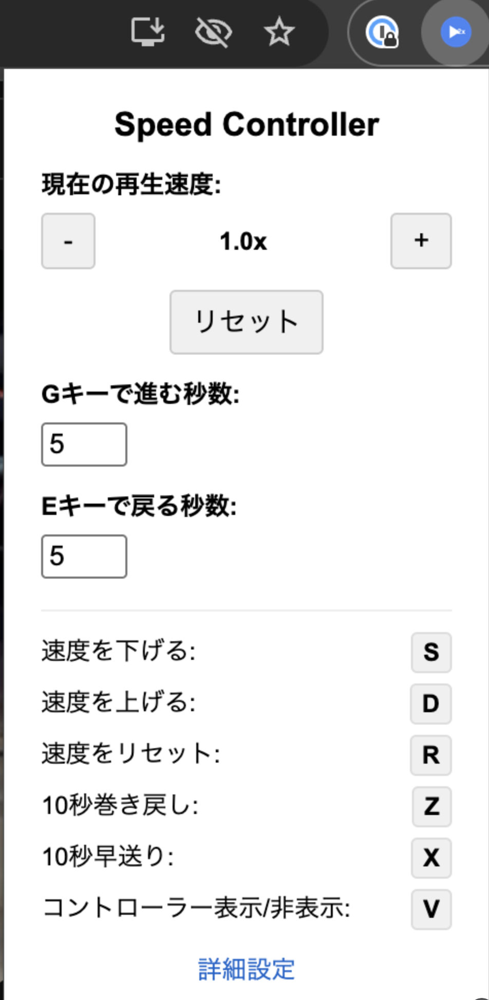

# Chrome Video Speed Adjuster

HTML5ビデオの再生速度を変更するためのChrome拡張機能です。

## 機能

- ウェブサイト上のHTML5ビデオの再生速度を変更できます
- ビデオの左上に再生速度を表示します
- キーボードショートカットで簡単に操作できます
- 巻き戻しや早送りの機能も搭載しています
- コントローラーの非表示時間をカスタマイズ可能

## インストール方法

### 開発版をインストールする場合

1. このリポジトリをクローンまたはダウンロードします
   ```
   git clone https://github.com/c9katayama/chrome-video-speed-adjuster.git
   ```
2. Chromeで `chrome://extensions` を開きます
3. 右上の「デベロッパーモード」をオンにします
4. 「パッケージ化されていない拡張機能を読み込む」をクリックします
5. ダウンロードしたフォルダを選択します

## 使い方

拡張機能をインストールすると、HTML5ビデオを含むウェブページを開いたときに、ビデオの左上に再生速度インジケーターが表示されます。

### キーボードショートカット

デフォルトのキーボードショートカットは以下の通りです：

- **S** - 再生速度を下げる
- **D** - 再生速度を上げる
- **R** - 再生速度をリセット
- **Z** - 10秒巻き戻し
- **X** - 10秒早送り
- **E** - 5秒巻き戻し
- **G** - 5秒早送り
- **V** - コントローラーの表示/非表示を切り替え

### カスタマイズ

拡張機能のオプションページやポップアップから、以下の設定をカスタマイズできます：

<p align="center">
  
</p>

| 設定項目 | 説明 | デフォルト値 |
|----------|------|--------------|
| 速度変更ステップ | 再生速度を1回でどれだけ変えるか | 0.1 |
| リセット時の速度 | 「リセット」で戻る速度 | 1.0 |
| 巻き戻し時間 | Zキーで巻き戻す秒数 | 10秒 |
| 早送り時間 | Xキーで早送りする秒数 | 10秒 |
| Gキーで早送り | Gキーで早送りする秒数 | 5秒 |
| Eキーで巻き戻し | Eキーで巻き戻す秒数 | 5秒 |
| コントローラー非表示までの時間 | コントローラーが自動で消えるまでの時間 | 2秒 |
| キーボードショートカット | 各機能のキー割り当て | S, D, R, Z, X, G, E, V |
| コントローラー初期表示 | 拡張機能起動時にコントローラーを表示するか | 表示 |

#### キーボードショートカット
- S: 再生速度を下げる
- D: 再生速度を上げる
- R: 再生速度をリセット
- Z: 指定秒数巻き戻し
- X: 指定秒数早送り
- G: 小刻み早送り
- E: 小刻み巻き戻し
- V: コントローラーの表示/非表示

これらの設定は、動画再生中に直感的にコントロールできるよう工夫されています。
## 開発

### 必要な環境

- Node.js
- npm

### セットアップ

```bash
# リポジトリのクローン
git clone https://github.com/c9katayama/chrome-video-speed-adjuster.git
cd chrome-video-speed-adjuster

# 依存パッケージのインストール
npm install

# アイコンの生成(アイコンを変更する場合)
node create_icons.js
```

## 注意事項

- この拡張機能はHTML5ビデオにのみ対応しています
- 一部のウェブサイトでは、キーボードショートカットが他の機能と競合する場合があります
- ローカルファイルでの使用には、拡張機能の設定でファイルURLへのアクセスを許可する必要があります

